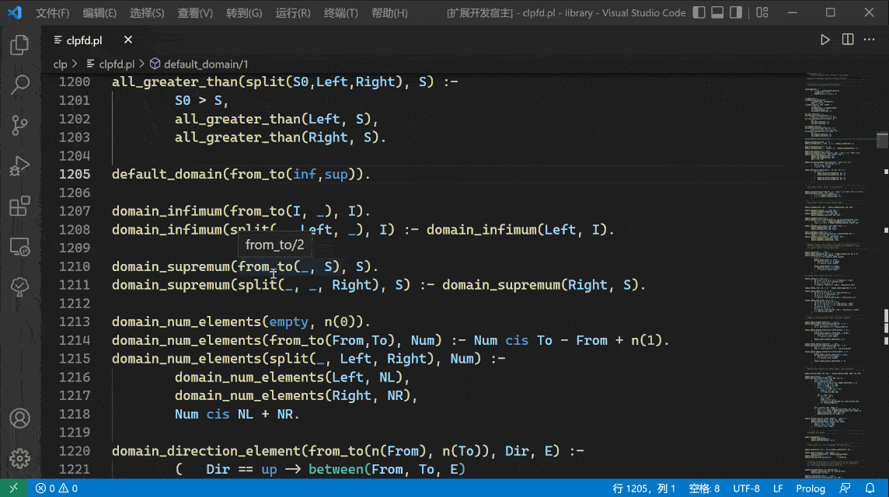

# SWI Prolog LSP
- [x] Outline
- [x] Diagnostics (Bug. You can choose to turn off by setting `"swi-lsp.sendDiagnostics":"false"`)
- [x] Goto Definition (Only in one file)
- [x] Find References (Only in one file)
- [ ] Show Call Hierarchy (Work in progress)
- [ ] WorkSpace (It's not started yet)

## Outline
 
## Goto Definition

## Find References
